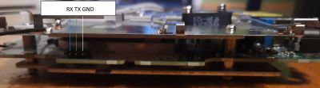

### 以下内容仅供参考

**转载请标明以下来源信息**

**Source:** 
1. https://openwrt.org/inbox/toh/zyxel/nbg7815_armor_g5
2. https://forum.openwrt.org/t/openwrt-support-for-armor-g5-nbg7815/98598/62
3. https://forum.openwrt.org/t/openwrt-support-for-armor-g5-nbg7815/98598/71
4. https://forum.openwrt.org/t/openwrt-support-for-armor-g5-nbg7815/98598/73
5. https://github.com/itorK/openwrt/tree/nbg7815


## root 访问权限

以下是 root 访问的步骤：

1. 断开 WAN 口的网线
2. 按下 reset 按钮 15 秒，将 Armor G5 重置为出厂默认设置，此时 LED 灯为闪烁的橙色
3. 5 - 10 分钟后，当 LED 变为深蓝色常亮时，插入 LAN 口的网线并通过 telnet  连接到 192.168.123.1 端口 23 上
4. 迅速輸入以下登陆信息：
```
NBG7815 login: root
password: nbg7815@2019
```

 请你遵循下面的 [SSH 访问权限](https://github.com/1054009064/G5_zh-CN#ssh-%E8%AE%BF%E9%97%AE%E6%9D%83%E9%99%90) 步骤，否则路由器设置后，root 将会被系统修改


## SSH 访问权限

首先，你需要获得 root 访问权限（请参阅 [root 访问权限](https://github.com/1054009064/G5_zh-CN#root-%E8%AE%BF%E9%97%AE%E6%9D%83%E9%99%90) 部分）

在配置中启用 dropbear 守护进程
```
root@NBG7815:~# uci set dropbear.setting.enable=1
root@NBG7815:~# uci commit dropbear
```

保存以下网络配置：
```
root@NBG7815:~# uci set network.general.auto_ip_change=0
root@NBG7815:~# uci commit network
```

注释初始化脚本文件中的行，如下：
```
root@NBG7815:~# vi /etc/init.d/preboot

        #dropbear
        #ck_dropbear=$(uci get dropbear.setting.enable)
        #if [ "$ck_dropbear" != "0" ]; then
        #       uci set dropbear.setting.enable=0
        #       uci commit dropbear
        #fi

        # If user already installed it will lock login permission
        #install_mode=$(uci get system.main.install_mode)
        #if [ "$install_mode" == "1" ]; then
        #       znet_setroot
        #fi
```

完成这些步骤后，你的 root 密码将不会被系统更改，并且每次启动 Armor G5 时都会启动 dropbear 守护程序


## 获取完全的 U-Boot 访问权限



*图示为连接到 ttl 模块端口上的线序，实际机器上 Rx 和 Tx 相反*

ZyXEL NBG7815 (Armor G5) 串口参数：TTL 115200, 8N1, 3.3V

按上图示到接到串口

1. 重启后，按任意键中断自动启动：
```
Zyxel zloader v1.0.0 (2020-01-06 - 08:24)


Multiboot clinent version: 2.0
ipq807x_eth_halt: done
eth0 PHY0 Down Speed :10 Half duplex
eth0 PHY1 Down Speed :10 Half duplex
eth0 PHY2 Down Speed :10 Half duplex
eth0 PHY3 Down Speed :10 Half duplex
eth0 PHY4 Down Speed :10 Half duplex
10M speed not supported
ipq807x_eth_halt: done
Ethernet interface failed to initialized!

Hit any key to stop autoboot:  3
NBG7815>
```
2. 获取密码的 seed
```bash
ATSE NBG7815
```
```
NBG7815> 013D72FF0710
```

 Seed 每次都不会一样

 3. 生成密码
从 https://github.com/itorK/nbg7815_tools/blob/main/tool.sh 获取 bash 脚本，并使用你的 seed 计算密码，如下所示
```bash
wget https://raw.githubusercontent.com/itorK/nbg7815_tools/main/tool.sh
chmod 755 tool.sh
./tool.sh 013D72FF0710
```
ATEN 1,10F0A563

将输出放到终端
```bash
ATEN 1,10F0A563
```
4. 使用完整的 u-boot 访问权限登陆
```bash
ATGU
```

ZYXEL#


## 刷机

1. 通过 SSH 以 root 身份登录路由器并备份实际的分区:
```bash
mkdir /tmp/ApplicationData/backup
mkdir /tmp/ApplicationData/openwrt
dd if=/dev/mmcblk0p7 of=/tmp/ApplicationData/backup/hlos_blk0p7.bin
dd if=/dev/mmcblk0p8 of=/tmp/ApplicationData/backup/rootfs_blk0p8.bin
```
通过 WinSCP 客户端保存好这些分区到本地

2. 使用 WinSCP 客戶端将 kernel 和 root 文件放在 `/tmp/ApplicationData/openwrt` 文件夹中， 可以通过解压 openwrt-ipq807x-generic-zyxel_nbg7815-squashfs-sysupgrade.bin 文件（例如使用 7zip）来获得这些文件

3. 再次用 SSH 以 root 身份登陆到路由器并执行擦写命令：
```bash
dd if=/dev/zero of=/dev/mmcblk0p7
dd if=/tmp/ApplicationData/openwrt/kernel of=/dev/mmcblk0p7
    
dd if=/dev/zero of=/dev/mmcblk0p8 
dd if=/tmp/ApplicationData/openwrt/root of=/dev/mmcblk0p8
```
4. 最后，手动重启路由器（拔插电源）


## 恢复原厂固件

```bash
mount /dev/mmcblk0p11 /mnt
mkdir /mnt/backup
```
通过 WinSCP 将之前保存的分区备份放到 `/mnt/backup` 目录
```bash
dd if=/dev/zero of=/dev/mmcblk0p7
dd if=/mnt/backup/hlos_blk0p7.bin of=/dev/mmcblk0p7
  
dd if=/dev/zero of=/dev/mmcblk0p8 
dd if=/mnt/backup/rootfs_blk0p8.bin of=/dev/mmcblk0p8
```


## 救砖

方法一：
1. 获取 [initramfs](https://github.com/itorK/nbg7815_tools/blob/main/openwrt-ipq807x-generic-zyxel_nbg7815-initramfs-fit-uImage.itb)
2. 将电脑的 IP 地址设置为 192.168.1.99/24，网关 192.168.1.1，安裝 tftp 服务器（例如 SolarWinds TFTP，TFTPD64）
3. 将 initramfs 文件放到 TFTP 服务器的文件目录中
4. 关闭防火墙并通过网线连接到路由器
5. 中断 Uboot 的自动引导并执行 [获取完全的 U-Boot 访问权限](https://github.com/1054009064/G5_zh-CN#%E8%8E%B7%E5%8F%96%E5%AE%8C%E5%85%A8%E7%9A%84-u-boot-%E8%AE%BF%E9%97%AE%E6%9D%83%E9%99%90) 步骤
6. 执行以下命令：
```bash
tftpboot 0x44000000 192.168.1.99:openwrt-ipq807x-generic-zyxel_nbg7815-initramfs-fit-uImage.itb && bootm
```
初始化后，执行  [恢复原厂固件](https://github.com/1054009064/G5_zh-CN#%E6%81%A2%E5%A4%8D%E5%8E%9F%E5%8E%82%E5%9B%BA%E4%BB%B6) 步骤或 [刷机 3](https://github.com/1054009064/G5_zh-CN#%E5%88%B7%E6%9C%BA) 步骤

方法二：
1. 获取[原厂固件](https://d3jal3boi407dg.cloudfront.net/mycloud/nbg7815/latest_firmware_info/s3_file/1634698613953/V1.00(ABSK.7)C0.bin)
2. 将电脑的 IP 地址设置为 192.168.1.99/24，网关 192.168.1.1，安裝 tftp 服务器（例如 SolarWinds TFTP，TFTPD64）
3. 将 `V1.00(ABSK.7)C0.bin` 文件放到 TFTP 服务器的文件目录中
4. 关闭防火墙并通过网线连接到路由器
5. 中断 Uboot 的自动引导，无需解锁 Uboot，执行以下命令
```bash
ATUR V1.00(ABSK.7)C0.bin
```


## 其它
1. 升降级 web：https://192.168.123.1/gui/#/main/debug/firmwareupgrade
2. 分区信息
<details><summary>info</summary>

```
mtdblock0		0:SBL1			320
mtdblock1		0:MIBIB			64
mtdblock2		0:BOOTCONFIG		128
mtdblock3		0:BOOTCONFIG1		128
mtdblock4		0:QSEE			1536
mtdblock5		0:QSEE_1		1536
mtdblock6		0:DEVCFG		64
mtdblock7		0:DEVCFG_1		64
mtdblock8		0:APDP			64
mtdblock9		0:APDP_1		64
mtdblock1		0:RPM			256
mtdblock11		0:RPM_1			256
mtdblock12		0:CDT			64
mtdblock13		0:CDT_1			64
mtdblock14		0:APPSBL		768
mtdblock15		0:APPSBL_1		768
mtdblock16		0:APPSBLENV		64
mtdblock17		0:ART			256
mtdblock18		0:ETHPHYFW		512
mtdblock19		0:CRT			64
mtdblock20		DUAL_FLAG		64
mtdblock21		RESERVED		1088

mmcblk0p1		rootfs_data		8192
mmcblk0p2		header			1024
mmcblk0p3		0:HLOS			6144
mmcblk0p4		rootfs			61440
mmcblk0p5		squashfs		4096
mmcblk0p6		header_1		1024
mmcblk0p7		0:HLOS_1		6144
mmcblk0p8		rootfs_1		61440
mmcblk0p9		0:WIFIFW_1		4096
mmcblk0p10		nbg			524288
mmcblk0p11		appdata			2883584
```

</details>
